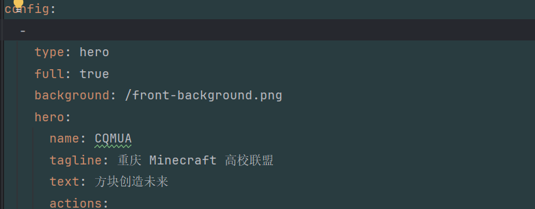

# 联系开发组

联系 `rand777` 进入渝高联开发组，并且告知你的ID，以便开通权限

## 分支管理

【此处Macrodd2022待写】
### 分支命名

### 内容审核

### 分支合并请求

### 发布测试环境

### 发布生产环境

## 文档规范
统一使用[markdown](https://markdown.com.cn/basic-syntax/)规范，编辑器推荐选 Typora、VSCode、Obsidian其一

## git提交规范
git提交规范参考[Angular](https://zj-git-guide.readthedocs.io/zh-cn/latest/message/Angular%E6%8F%90%E4%BA%A4%E4%BF%A1%E6%81%AF%E8%A7%84%E8%8C%83/)，理论上只需要修改文档 docs: xxxxxx

## 静态资源规范
所有静态资源放在 `docs/.vuepress/public` 下，使用时只需要/{文件名}即可，如**docs/README.md**中的 `/front-background.png`
